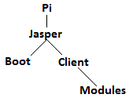

-Access RPi connected to Bea's LAN 
find the last IP address sent on amiproject.smartup@gmail.com and use it with Putty 
username: pi 
password: raspberry 

-Folder Tree 
</img>

-Update Rpi's Alfred software 
access the RPi from Putty and type the following commands 
<code>cd jasper/</code> 
<code>git pull https://github.com/AmI-2014/git-experiment-10/</code> 
insert your GitHub's user and pass 

-Boot Alfred manually and main consequently 
type 
<code>cd /jasper/boot</code> 
<code>python boot.py</code>

-Boot any module.py 
move in the folder containing the module.py 
<code>cd folder</code> 
<code>python module.py</code>

